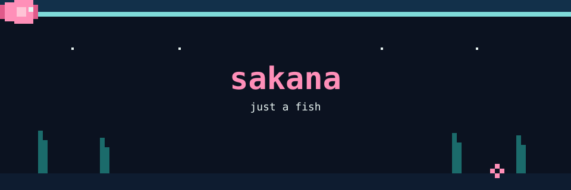
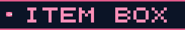
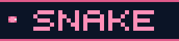

  

  
  
  

  

- [cursor-byok](https://github.com/Sakana-yuyu/cursor-byok) — bring your own key to Cursor
- [deepseek-harness-desktop](https://github.com/Sakana-yuyu/deepseek-harness-desktop) — desktop client for DeepSeek Harness
- [cockpit-tools](https://github.com/Sakana-yuyu/cockpit-tools) — small tools that keep the tank running

  

  
  
  
  
  
  
  

  

  <picture>
    <source media="(prefers-color-scheme: dark)" srcset="https://raw.githubusercontent.com/Sakana-yuyu/Sakana-yuyu/output/github-contribution-grid-snake-dark.svg" />
    
  </picture>

