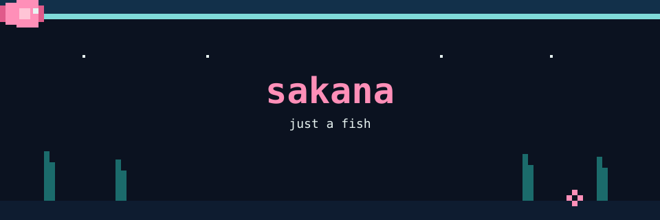
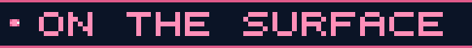

  

  <h1>Hi, I'm Sakana 👋</h1>
  
Building practical developer tools, desktop apps, and small experiments that make everyday work a little easier.

  
  
  

## Featured projects

| Project | What it is |
| --- | --- |
| [cursor-byok](https://github.com/Sakana-yuyu/cursor-byok) | Bring your own key to Cursor |
| [deepseek-harness-desktop](https://github.com/Sakana-yuyu/deepseek-harness-desktop) | Desktop client for DeepSeek Harness |
| [cockpit-tools](https://github.com/Sakana-yuyu/cockpit-tools) | Small tools that keep the tank running |

## Toolbox

  
  
  
  
  
  
  

## Activity

<picture>
  <source media="(prefers-color-scheme: dark)" srcset="https://raw.githubusercontent.com/Sakana-yuyu/Sakana-yuyu/output/github-contribution-grid-snake-dark.svg" />
  
</picture>

  
   
  Keep exploring. Keep shipping.

